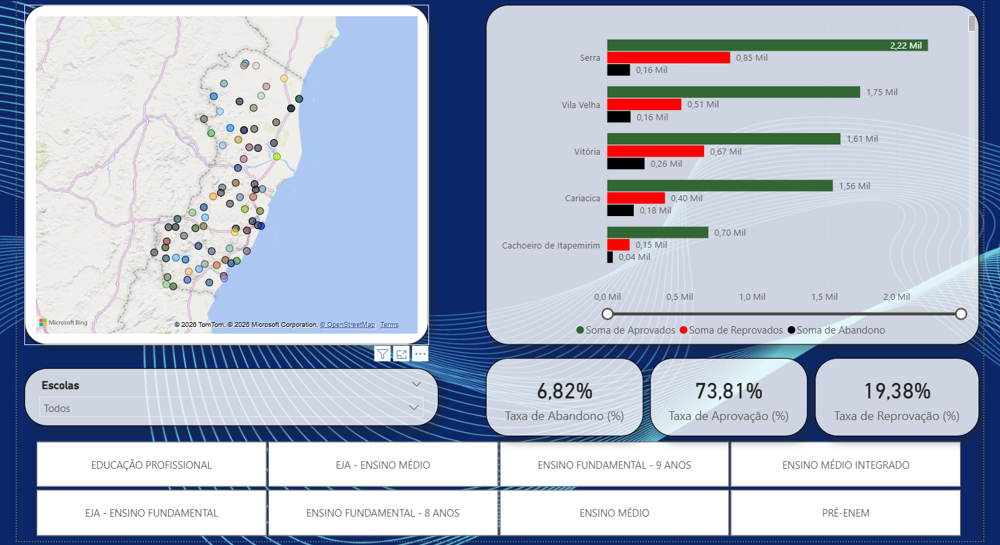
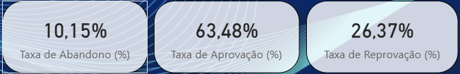
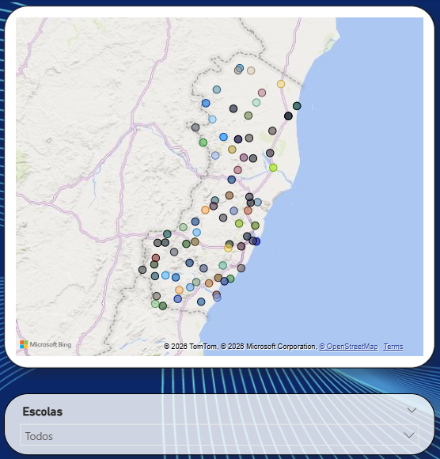

# 📊 Análise Educacional – Espírito Santo

Este projeto consiste no desenvolvimento de um dashboard em **Power BI** com base em **dados públicos educacionais do Estado do Espírito Santo**, com foco na análise de indicadores de desempenho escolar.

O dashboard permite a visualização e comparação de métricas como **taxa de aprovação, reprovação e abandono**, possibilitando análises dinâmicas por **município, escola e modalidade de ensino**.

O objetivo do projeto é **transformar dados educacionais em informações claras e acionáveis**, apoiando análises exploratórias, identificação de padrões e possíveis pontos de atenção no contexto educacional.

---

## 🎯 Objetivos do Dashboard
- Analisar indicadores educacionais de forma visual e intuitiva
- Permitir comparação entre municípios e escolas
- Apoiar a identificação de tendências e pontos críticos educacionais
- Explorar o uso de KPIs e filtros interativos no Power BI

---

## 🧠 Ferramentas Utilizadas
- Power BI Desktop  
- Power Query  
- Excel (fonte de dados)  
- Modelagem de dados (nível básico)  
- DAX (nível inicial)

---

## 📌 Principais Indicadores (KPIs)
- Taxa de aprovação (%)  
- Taxa de reprovação (%)  
- Taxa de abandono (%)  

---
## ▶️ Como utilizar o dashboard
- Utilize os filtros para selecionar município, escola ou modalidade de ensino
- Analise as taxas de aprovação, reprovação e abandono de forma comparativa
- Observe variações percentuais entre escolas e municípios
- Use os indicadores para identificar possíveis pontos de atenção educacional

---
## 🖼️ Visualizações do Dashboard

### Visão Geral

### Indicadores Educacionais

### Análise por Município / Escola

---
## 🚀 Status do Projeto
Em desenvolvimento — novas análises, melhorias visuais e indicadores adicionais serão incorporados continuamente.

